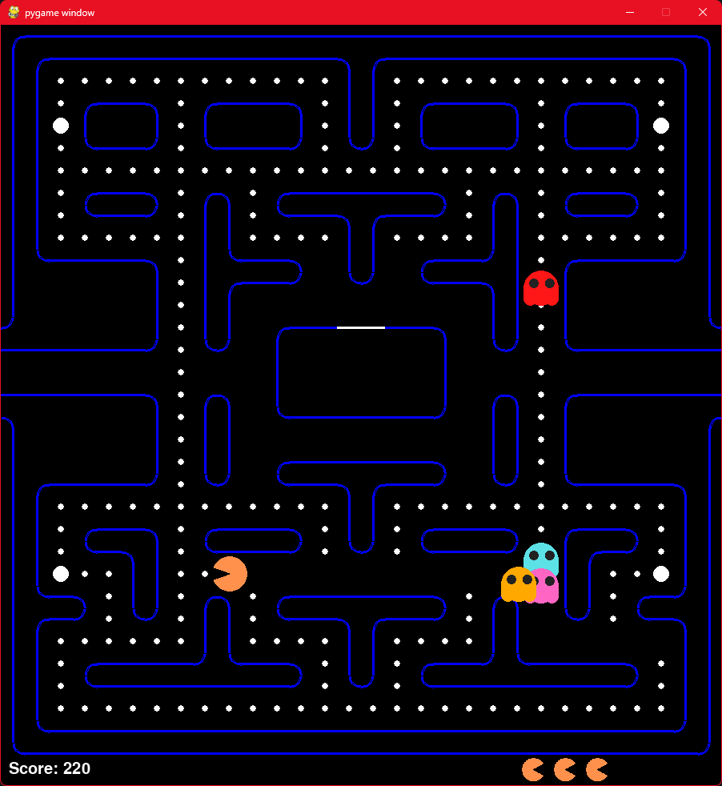

# Pacman Game using Python and Pygame



Welcome to the Pacman Game repository! This is a classic Pacman game implemented in Python using the Pygame library. Relive the nostalgia of chasing ghosts and gobbling pellets with this fun and interactive game.

## Table of Contents

- [Introduction](#introduction)
- [Features](#features)
- [Installation](#installation)
- [How to Play](#how-to-play)
- [Controls](#controls)
- [Requirements](#requirements)
- [Contributing](#contributing)
- [License](#license)

## Introduction

Pacman is a renowned arcade game that was first released in 1980. The objective of the game is for Pacman to eat all the pellets in a maze while avoiding being caught by ghosts. This project brings the Pacman experience to your computer screen using Python and the Pygame library.

## Features

- Classic Pacman gameplay.
- Colorful and visually appealing graphics.
- Different types of pellets, power-ups, and ghosts.
- Score tracking system.
- Sound effects for a more immersive experience.
- High score recording.

## Installation

1. Clone this repository to your local machine using:
```
git clone https://github.com/AdrijeGuha/CodeAlpha_PACMAN-GAME.git
```

2. Navigate to the project directory:

```
cd pacman-game
```

3. Install the required dependencies using:
```
pip install pygame
```

## How to Play

1. Run the game script:
```
python pacman.py
```

2. Use the arrow keys to navigate Pacman through the maze.

3. Eat all the pellets to clear each level.

4. Avoid ghosts. If Pacman collides with a ghost:
   - If Pacman has not consumed a power pellet, he loses a life.
   - If Pacman has consumed a power pellet, he can eat the ghosts for a limited time.

5. Consume power pellets to turn the ghosts blue and gain the ability to eat them.


7. Complete the level and aim for a high score!

## Controls

- **Arrow Up:** Move Pacman upward.
- **Arrow Down:** Move Pacman downward.
- **Arrow Left:** Move Pacman to the left.
- **Arrow Right:** Move Pacman to the right.

## Requirements

- Python 3.x
- Pygame library

## Contributing

Contributions are welcome! If you find any issues or would like to enhance the game, feel free to submit a pull request. <!--Please ensure to follow the [Contributing Guidelines](CONTRIBUTING.md).-->

## License

This project is licensed under the [The Unlicense](LICENSE).

---

Enjoy the game, and have fun gobbling those pellets and evading those ghosts! If you have any questions or feedback, feel free to create an issue in the repository.